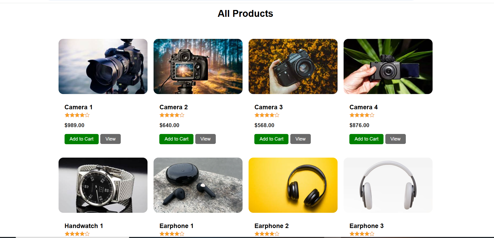
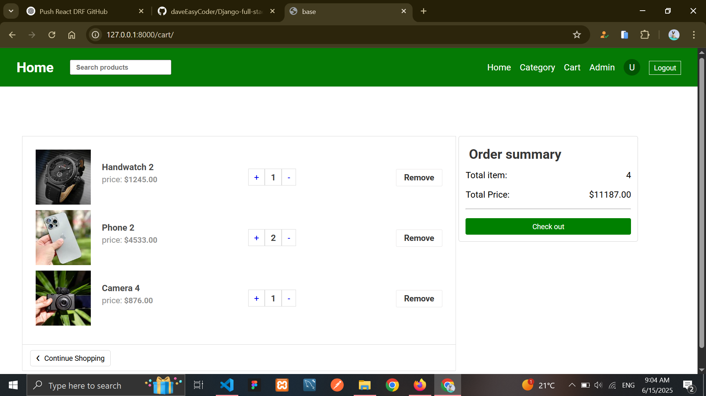
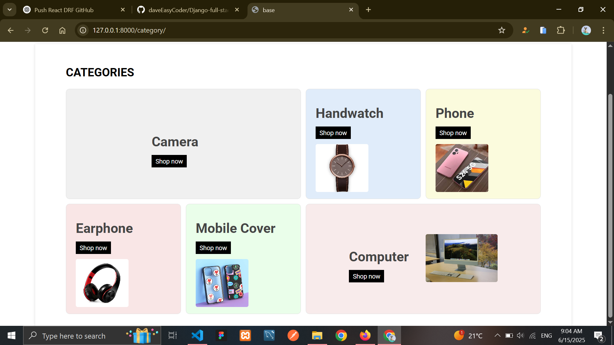
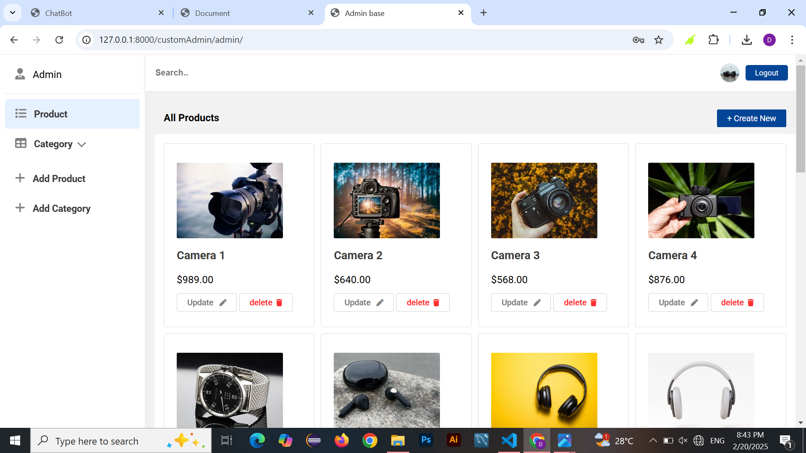
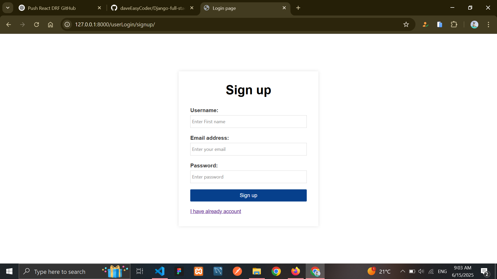
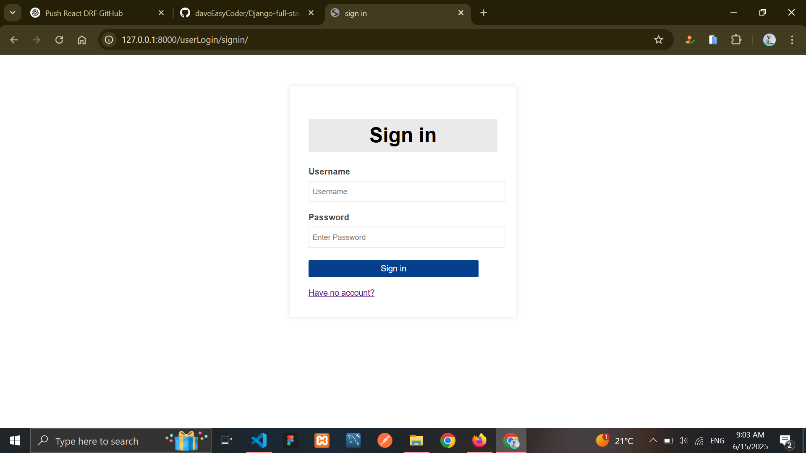

# 🛒 Django eCommerce Platform

A full-featured eCommerce web application built with Django. This project allows users to browse products, manage their cart, explore categories, and admins to manage products and orders through a custom admin dashboard.

---

## 🚀 Features

- 🏠 Homepage with featured products
- 🛍️ Add to cart, update quantity, delete from cart
- 📂 Product categories with filtering
- 🔎 Product detail pages
- 👨‍💻 Admin dashboard to manage products, categories, and orders
- 📱 Responsive UI using HTML, CSS, and Bootstrap/Tailwind (optional)
- 📦 MySQL or SQLite database integration

---

## 📸 Screenshots

### 🏠 Hero  


---
### 🏠 Product  


---

### 🛒 Cart Page  


---

### 📂 Category Page  


---

### ⚙️ Admin Dashboard  

### ⚙️ signup page  

### ⚙️ signin page  



---

## 🛠️ Built With

- Python 3
- Django Framework
- MySQL or SQLite (Database)
- HTML5 & CSS3
- JavaScript / AJAX 

---

## 🧑‍💻 About the Developer

**Dawit Tiruneh**  
Software Engineering Student | Full-Stack Web Developer  
📧 Email: [your_email@example.com](mailto:dawittechguru.com)  
💻 GitHub: [github.com/daveEasyCoder](https://github.com/daveEasyCoder)  
📱 Telegram: [@yourTelegramUsername](https://t.me/davetechguru)

---

## 🧪 How to Run the Project Locally

1. **Clone the repository**  
```bash
git clone https://github.com/daveEasyCoder/django-ecommerce.git
cd django-ecommerce
